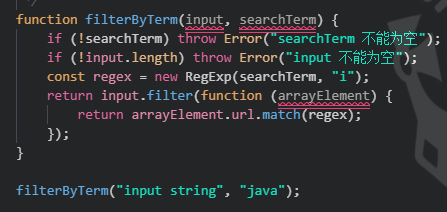
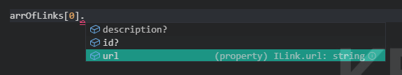

<!--
 * @Author: 看法是豆腐
 * @Date: 2019-11-04 14:40:24
 * @LastEditors: 看法是豆腐
 * @LastEditTime: 2019-11-06 17:04:56
 * @Description: file content
 -->

# TypeScript-Learning

Learning TypeScript from the begining

## TypeScript 配置

安装 TypeScript

```
npm i typescript --save-dev
```

在 package.json 中添加 TypeScript 编译指令

```
"scripts": {
    "tsc": "tsc
}
```

tsc 是 TypeScript 的编译器，将 TypeScript 编译为 JavaScript。

生成 TypeScript 配置文件`tsconfig.json`

```
npm run tsc -- --init
```

## 配置 TypeScript 编译器

生成的配置项有很多，我们先使用其中个别配置，先将`tsconfig.json`中配置为以下内容：

```
{
  "compilerOptions": {
    "target": "es5",
    "strict": true
  }
}
```

TypeScript 是由 TypeScript 编译器和任何具有 TypeScript 支持的代码编译器读取。

属性列举：

- **noImplicitAny** `true`:当变量没有定义类型时，TypeScript 会报错

- **alwaysStrict** `true`：严格模式是 JS 的安全机制，它可以防止意外的全局变量，默认的`this`绑定等。设置为`alwaysStrict`时，TypeScript 在每个 JS 文件的顶部都使用`use strict`。

还有很多配置选项随着后面的学习，会了解更多。

## 关于类型

TypeScript 支持与 JS 几乎相同的数据类型，此外，TypeScript 自己添加了更多的类型，如 `any` 类型一样。

`any` 是松散的 TypeScript 类型。 这意味着：此变量可以是任何类型：字符串，布尔值，对象等。 实际上，这就像根本没有类型检查。

## TypeScript 中的行为

在项目文件夹中创建一个名为 `filterByTerm.js` 的新文件，并输入以下内容

```
function filterByTerm(input, searchTerm) {
  if (!searchTerm) throw Error("searchTerm 不能为空")
  if (!input.length) throw Error("input 不能为空")
  const regex = new RegExp(searchTerm, "i")
  return input.filter(function(arrayElement) {
    return arrayElement.url.match(regex)
  })
}

filterByTerm("input string", "java")
```

我想知道是否有一种方法可以在我的 IDE 中检查这个函数，而不需要运行代码或者用 Jest 测试它。这可能吗? TypeScript 在这方面做得很好，实际上它是 JS 中静态检查的最佳工具，也就是说，**在代码运行之前测试代码的正确性**。

将文件的扩展名从 `filterByTerm.js` 改为 `filterByTerm.ts`。通过这种更改，你会发现代码中的一堆错误



确定哪个地方错：

```
npm run tsc
```

可以看到控制台报错：

```
> tsc

filterByTerm.ts:8:23 - error TS7006: Parameter 'input' implicitly has an 'any' type.

8 function filterByTerm(input, searchTerm) {
                        ~~~~~

filterByTerm.ts:8:30 - error TS7006: Parameter 'searchTerm' implicitly has an 'any' type.

8 function filterByTerm(input, searchTerm) {
                               ~~~~~~~~~~

filterByTerm.ts:12:35 - error TS7006: Parameter 'arrayElement' implicitly has an 'any' type.

12     return input.filter(function (arrayElement) {
                                     ~~~~~~~~~~~~
```

TypeScript 告诉你错误是参数隐式具有`any`类型。它可以是 TypeScript 中的`any`类型， 我们需要在我们的 TypeScript 代码中添加适当的类型注释。

## 什么是类型，JS 中有什么问题

目前 JS 有七种类型

- String
- Number
- Boolean
- Null
- Undefined
- Object
- Symbol(ES6)

除了 Object 类型外，其它是 JS 的基本数据类型。每种 JS 类型都有相应的表示，可以代码中使用，比如字符串和数字

```
let name = "Hello John"
let age = 33
```

JS 的问题是，变量可以随时更改其类型。例如，布尔值可以变成字符串(将以下代码保存到名为`types.js`的文件中)

```
let aBoolean = false
console.log(typeof aBoolean) // "boolean"

aBoolean = "Tom"
console.log(typeof aBoolean) // "string"
```

转换可以是有意的，开发人员可能真的希望将 Tom 分配到 aBoolean，但是这类错误很可能是偶然发生的。

从技术上讲，JS 本身没有什么问题，因为它的类型动态是故意的。JS 是作为一种简单的 web 脚本语言而诞生的，而不是作为一种成熟的企业语言。

然而，JS 松散的特性可能会在你的代码中造成严重的问题，破坏其可维护性。TypeScript 旨在通过向 JS 添加强类型来解决这些问题。实际上，如果将 `types.js` 的扩展更改为 `types.ts` 。你会在 IDE 中看到 TypeScript 的抱怨。

types.ts 的编译控制台会报错：

```
type.ts:11:1 - error TS2322: Type '"Tom"' is not assignable to type 'boolean'.

11 aBoolean = "Tom"
   ~~~~~~~~
```

有了这些知识，接着，咱们更深入地研究 TypeScript 类型。

## 深入 TypeScript 类型

TypeScript 强调有类型，咱们上面的代码根本没有类型，是时候添加一些了。首先要修正函数参数。通过观察这个函数是如何调用的，它似乎以两个字符串作为参数:

```
filterByTerm("input string", "java")
```

为参数添加类型：

```
function filterByTerm(input: string, searchTerm: string) {
    // ...
}

// ...
```

接着编译：

```
npm run tsc
```

剩下的错误：

```
filterByTerm.ts:12:18 - error TS2339: Property 'filter' does not exist on type 'string'.

12     return input.filter(function (arrayElement) {

```

可以看到 TypeScript 是如何指导我们，现在的问题在于 `filter` 方法。

```
function filterByTerm(input: string, searchTerm: string) {
  // 省略一些
  return input.filter(function(arrayElement) {
    return arrayElement.url.match(regex)
  })
}
```

咱们告诉 TypeScript `“input”` 是一个字符串，但是在后面的代码中调用了 `filter` 方法，它属于数组。我们真正需要的是将输入标记为某个东西的数组，可能是字符串数组：

为此，有两个选择。选项 1：`string[]`

```
function filterByTerm(input: string[], searchTerm: string) {
    // ...
}
```

选项 2: `Array<Type>`

```
function filterByTerm(input: Array<string>, searchTerm: string) {
    // ...

}
```

我个人更喜欢选项 2。 现在，尝试再次编译（`npm run tsc`），控制台信息如下：

```
filterByTerm.ts:17:14 - error TS2345: Argument of type '"input string"' is not assignable to parameter of type 'string[]'.

17 filterByTerm("input string", "java")
                ~~~~~~~~~~~~~~
```

TypeScript 还会校验传入的类型。 我们将 input 改为字符串数组：

```
filterByTerm(["string1", "string2", "string3"], "java")
```

这是到目前为止的完整代码：

```
function filterByTerm(input: Array<string>, searchTerm: string) {
    if (!searchTerm) throw Error("searchTerm 不能为空")
    if (!input.length) throw Error("input 不能为空")
    const regex = new RegExp(searchTerm, "i")
    return input.filter(function (arrayElement) {
        return arrayElement.url.match(regex)
    })
}

filterByTerm(["string1", "string2", "string3"], "java")
```

看上去很好，但是，编译（npm run tsc）还是过不了：

```
filterByTerm.ts:13:29 - error TS2339: Property 'url' does not exist on type 'string'.

13         return arrayElement.url.match(regex)
                               ~~~
```

TypeScript 确实很严谨。 我们传入了一个字符串数组，但是在代码后面，尝试访问一个名为 “url” 的属性：

```
return arrayElement.url.match(regex)
```

这意味着咱们需要一个对象数组，而不是字符串数组。咱们在下一节中解决这个问题。

## TypeScript 对象和接口

上面遗留一个问题：因为 filterByTerm 被传递了一个字符串数组。url 属性在类型为 string 的 TypeScript 上不存在。所以咱们改用传递一个对象数组来解决这个问题：

```
filterByTerm(
  [{ url: "string1" }, { url: "string2" }, { url: "string3" }],
  "java"
)
```

函数定义也要对应的更改：

```
function filterByTerm(input: Array<object>, searchTerm: string) {
    // ...
}
```

现在让我们编译代码，控制台输出:

```
filterByTerm.ts:13:25 - error TS2339: Property 'url' does not exist on type 'object'.

13     return arrayElement.url.match(regex)
                           ~~~
```

又来了，通用 JS 对象没有任何名为 url 的属性。对我来说，TypeScript 对类型要求真的是很严谨。

这里的问题是，咱们不能给一个随机对象分配属性，TypeScript 的核心原则之一是对值所具有的结构进行类型检查， 在 TypeScript 里，**接口（interface）的作用就是为这些类型命名和为你的代码或第三方代码定义契约，咱们可以使用接口**来解决这个问题。

通过查看我们的代码，我们可以想到一个名为 `Link` 的简单 **"模型"**，其结构应该符合以下模式：它必须有一个类型为 `string` 的 `url` 属性。

在 TypeScript 中，你可以用一个接口来定义这个模型，就像这样(把下面的代码放在 `filterByTerm.ts` 的顶部):

```
interface ILink {
  url: string
}
```

对于接口声明，这当然不是有效的 `JS` 语法，在编译过程中会被删除。

提示:在定义接口名字前面加上大写的 `I`，这是 `TypeScript` 的惯例。

现在，使用使用接口 `ILink` 定义 `input` 类型

```
function filterByTerm(input: Array<ILink>, searchTerm: string) {
    // ...
}
```

通过此修复，可以说 TypeScript **“期望 ILink 数组”** 作为该函数的输入，以下是完整的代码：

```
interface ILink {
  url: string
}

function filterByTerm(input: Array<ILink>, searchTerm: string) {
  if (!searchTerm) throw Error('searchTerm 不能为空')
  if (!input.length) throw Error('input 不能为空')
  const regex = new RegExp(searchTerm, 'i')
  return input.filter(function(arrayElement) {
    return arrayElement.url.match(regex)
  })
}

filterByTerm(
  [{ url: 'string1' }, { url: 'string2' }, { url: 'string3' }],
  'java'
)
```

此时，所有的错误都应该消失了

## 接口和字段

TypeScript 接口是该语言最强大的结构之一。接口有助于在整个应用程序中形成模型，这样任何开发人员在编写代码时都可以选择这种模型并遵循它。

前面，咱们定义了一个简单的接口 `ILink`

```
interface ILink {
  url: string
}
```

如果您想要向接口添加更多的字段，只需在块中声明它们即可：

```
interface ILink {
  description: string
  id: number
  url: string
}
```

现在，类型为 `ILink` 的对象都必须实现新字段，否则就会出现错误，如果把上面 的定义重新写入 `filterByTerm.ts` 然后重新编译就会报错了：

```
filterByTerm.ts:24:4 - error TS2739: Type '{ url: string }' is missing the following properties from type 'ILink': description, id

24   [{ url: 'string1' }, { url: 'string2' }, { url: 'string3' }],
      ~~~~~~~~~~~~~~~~~~
```

问题在于我们函数的参数：

```
filterByTerm(
  [{ url: "string1" }, { url: "string2" }, { url: "string3" }],
  "java"
)
```

TypeScript 可以通过函数声明来推断参数是 `ILink` 的类型数组。因此，该数组中的任何对象都必须实现接口 `ILink` 中定义的所有字段

大多数情况下，实现所有字段是不太现实的。毕竟，咱也不知道 `ILink` 类型的每个新对象是否会需要拥有所有字段。不过不要担心，要使编译通过，可以声明接口的字段可选，使用 `?` 表示：

```
interface ILink {
    description?: string
    id?: number
    url: string
}
```

现在编辑器和编译器都没问题了。然而 `TypeScript` 接口可以做的更多，在下一节我们将看到如何扩展它们。但首先简要介绍一下 `TypeScript` 中的变量。

## 变量声明

```
function filterByTerm(input: Array<ILink>, searchTerm: string) {
    //
}
```

`TypeScript` 并不限于此，当然也可以向任何变量添加类型。为了说明这个例子，咱们一一地提取函数的参数。首先咱要提取每一个单独的对象：

```
const obj1: ILink = { url: "string1" }
const obj2: ILink = { url: "string2" }
const obj3: ILink = { url: "string3" }
```

接下来我们可以像这样定义一个 `ILink` 数组:

```
const arrOfLinks: Array<ILink> = [obj1, obj2, obj3]
```

参数 `searchTerm` 对应的类型可以这样：

```
const term: string = "java"
```

以下是完整的代码：

```
interface ILink {
  description?: string
  id?: number
  url: string
}

function filterByTerm(input: Array<ILink>, searchTerm: string) {
  if (!searchTerm) throw Error('searchTerm 不能为空')
  if (!input.length) throw Error('input 不能为空')
  const regex = new RegExp(searchTerm, 'i')
  return input.filter(function(arrayElement) {
    return arrayElement.url.match(regex)
  })
}

const obj1: ILink = { url: 'string1' }
const obj2: ILink = { url: 'string2' }
const obj3: ILink = { url: 'string3' }

const arrOfLinks: Array<ILink> = [obj1, obj2, obj3]

const term: string = 'java'

filterByTerm(arrOfLinks, term)
```

与 `JS` 相比，`TypeScript`看起来更冗长，有时甚至是多余的。但是随着时间的推移，会发现添加的类型越多，代码就越健壮。

通过添加类型注释，对 `TypeScript` 的了解也越多，还可以帮助你更好地理解代码的意图。

例如，`arrOfLinks` 与正确的类型（`ILink`的数组）相关联，咱们编辑器就可以推断出数组中的每个对象都有一个名为`url`的属性，如接口 `ILink` 中所定义：



除了字符串、数组和数字之外，`TypeScript` 还有更多类型。有 `boolean`，`tuple` (元组)，`any`, `never`，`enum`。

现在，咱们继续扩展接口。

## 扩展接口

`TypeScript` 接口很好。但是，如果哪天咱们需要一个新的对象，所需的类型跟现在有接口基本差不多。假设我们需要一个名为 `IPost` 的新接口，它具有以下属性：

- id, number
- title, string
- body, string
- url, string
- description, string

该接口的字段其中有些，我们 `ILink` 接口都有了。

```
interface ILink {
  description?: string
  id?: number
  url: string
}
```

是否有办法重用接口 `ILink ?` 在 `TypeScript` 中，可以使用继承来扩展接口，关键字用 `extends` 表示：

```
interface ILink {
  description?: string
  id?: number
  url: string
}

interface IPost extends ILink {
    title: string
    body: string
}

const post1: IPost = {
  description:
    'TypeScript tutorial for beginners is a tutorial for all the JavaScript developers ...',
  id: 1,
  url: 'www.valentinog.com/typescript/',
  title: 'TypeScript tutorial for beginners',
  body: 'Some stuff here!'
}
```

当像 `post1` 这样的对象使用一个接口时，我们说 `post1` 实现了该接口中定义的属性。

扩展接口意味着借用其属性并扩展它们以实现代码重用。当然 `TypeScript` 接口还也可以描述函数，稍后会看到。

## 索引

`JS` 对象是键/值对的容器。 如下有一个简单的对象:

```
const paolo = {
  name: "Paolo",
  city: "Siena",
  age: 44
}
```

我们可以使用点语法访问任何键的值:

```
console.log(paolo.city)
```

现在假设键是动态的，我们可以把它放在一个变量中，然后在括号中引用它

```
const paolo = {
  name: "Paolo",
  city: "Siena",
  age: 44
}

const key = "city"

console.log(paolo[key])
```

现在咱们添加另一个对象，将它们都放到一个数组中，并使用`filter`方法对数组进行筛选，就像我们在 `filterByTerm.js` 中所做的那样。但这一次键是动态传递的，因此可以过滤任何对象键：

```
const paolo = {
  name: "Paolo",
  city: "Siena",
  age: 44
}

const tom = {
  name: "Tom",
  city: "Munich",
  age: 33
}

function filterPerson(arr, term, key) {
  return arr.filter(function(person) {
    return person[key].match(term)
  })
}

filterPerson([paolo, tom], "Siena", "city")
```

这是比较重要的一行行

```
return person[key].match(term)
```

能行吗 是的，因为 `JS` 不在乎 `paolo` 或 `tom` 是否可通过动态 `[key]` 进行“索引化”。 那在 `TS` 又是怎么样的呢？

在下一部分中，我们将使用动态键使 `filterByTerm` 更加灵活。

## 接口可以有索引

让我们回到 `filterByTerm.ts` 中 `filterByTerm` 函数

```
function filterByTerm(input: Array<ILink>, searchTerm: string) {
  if (!searchTerm) throw Error('searchTerm 不能为空')
  if (!input.length) throw Error('input 不能为空')
  const regex = new RegExp(searchTerm, 'i')
  return input.filter(function(arrayElement) {
    return arrayElement.url.match(regex)
  })
}
```

它看起来不那么灵活，因为对于每个 `ILink`，咱们都使用硬编码方式将属性 `url` 与正则表达式相匹配。我们希望使动态属性(也就是键)让代码更灵活：

```
function filterByTerm(
  input: Array<ILink>,
  searchTerm: string,
  lookupKey: string = 'url'
) {
  if (!searchTerm) throw Error('searchTerm 不能为空')
  if (!input.length) throw Error('input 不能为空')
  const regex = new RegExp(searchTerm, 'i')
  return input.filter(function(arrayElement) {
    return arrayElement[lookupKey].match(regex)
  })
}
```

`lookupKey` 是动态键，这是给它分配了默认参数 `“url”`。 接着编译代码当然会报错：

```
filterByTerm.ts:37:12 - error TS7053: Element implicitly has an 'any' type because expression of type 'string' can't be used to index type 'ILink'.
  No index signature with a parameter of type 'string' was found on type 'ILink'.

37     return arrayElement[lookupKey].match(regex)
              ~~~~~~~~~~~~~~~~~~~~~~~
```

元素隐式具有 `"any"` 类型，因为类型 `“ILink”` 没有索引签名，需要你添加一个索引到对象的接口，这很容易解决。

转到接口 `ILink` 并添加索引：

```
interface ILink {
  description?: string
  id?: number
  url: string
  [index: string]: string
}
```

语法有点奇怪，但类似于对象上的动态键访问。这意味着我们可以通过类型为 `string` 的索引访问该对象的任何键，该索引反过来又返回另一个字符串。

不过，这样写会引发其它错误：

```
filterByTerm.ts:9:3 - error TS2411: Property 'description' of type 'string | undefined' is not assignable to string index type 'string'.
9   description?: string
    ~~~~~~~~~~~
filterByTerm.ts:10:3 - error TS2411: Property 'id' of type 'number | undefined' is not assignable to string index type 'string'.
10   id?: number
     ~~
```

这是因为接口上的一些属性是可选的，可能是 `undefined`，而且返回类型不总是`string`(例如，id 是一个 `number`)。

```
interface ILink {
  description?: string
  id?: number
  url: string
  [index: string]: string | number | undefined
}
```

表示该索引是一个字符串，可以返回另一个字符串、数字或 undefined。尝试再次编译，这里有另一个错误

```
filterByTerm.ts:38:36 - error TS2339: Property 'match' does not exist on type 'string | number'.
  Property 'match' does not exist on type 'number'.

38     return arrayElement[lookupKey].match(regex)
```

报的没毛病。`match` 方法只存在字符串中 ，而且我们的索引有可能返回一个 `number`。为了修正这个错误，我们可以使用 `any` 类型：

```
interface ILink {
  description?: string
  id?: number
  url: string
  [index: string]: any
}
```

## 函数的返回类型

到目前为止有很多新东西。现在来看看 `TypeScript` 的另一个有用的特性:**函数的返回类型**。

回到 `filterByTerm` 函数：

```
function filterByTerm(
  input: Array<ILink>,
  searchTerm: string,
  lookupKey: string = 'url'
) {
  if (!searchTerm) throw Error('searchTerm 不能为空')
  if (!input.length) throw Error('input 不能为空')
  const regex = new RegExp(searchTerm, 'i')
  return input.filter(function(arrayElement) {
    return arrayElement[lookupKey].match(regex)
  })
}
```

如果按原样调用，传递前面看到的 `ILink` 数组和搜索词`string3`，则如预期的那样返回一个对象数组：

```
filterByTerm(arrOfLinks, "string3")

// EXPECTED OUTPUT:
// [ { url: 'string3' } ]
```

但现在考虑一个更改的变体：

```
function filterByTerm(
  input: Array<ILink>,
  searchTerm: string,
  lookupKey: string = 'url'
) {
  if (!searchTerm) throw Error('searchTerm 不能为空')
  if (!input.length) throw Error('input 不能为空')
  const regex = new RegExp(searchTerm, 'i')
  return input
    .filter(function(arrayElement) {
      return arrayElement[lookupKey].match(regex)
    })
    .toString()
}
```

如果现在调用，使用相同的 `ILink` 数组和搜索词 `string3`，它将返回 `[object object]`

```
filterByTerm(arrOfLinks, "string3")

// WRONG OUTPUT:
// [object Object]
```

该函数没有按照预期工作，如果对 `JS` 隐式类型转换不清楚就很难发现问题。幸运的是，`TypeScript` 可以捕获这些错误，就像你在编辑器中写的那样。

修正如下：

```
function filterByTerm(/* 省略 */): Array<ILink> {
 /* 省略 */
}
```

通过在函数体之前添加类型注释，告诉 TypeScript 期望另一个数组作为返回值。现在这个 bug 很容易被发现

## 类型别名 vs 接口

到目前为止，我们已经将接口视为描述对象和自定义类型的工具。但是通过其他人的代码，你可能也注意到了关键字的 `type`。

显然，`interface` 和 `type` 在 `TypeScript` 中可以互换使用，但是它们在许多方面有所不同，这就是`TypeScript` 给初学者的困惑。

请记住: `TypeScript` 中的接口描述是某个东西的结构，大多数情况下是一个复杂的对象。

另一方面，`type` 也可以用来描述自定义的结构，但它只是一个别名，或者换句话说，是自定义类型的标签。例如，设想一个有两个字段的接口，其中一个是布尔型、数字型和字符串型的**联合类型**。

```
interface IExample {
  authenticated: boolean | number | string
  name: string
}
```

例如，使用 `type` 别名 可以提取自定义联合类型，并创建名为 `Authenticated` 的标签

```
type Authenticated = boolean | number | string

interface IExample {
  authenticated: Authenticated
  name: string
}
```

通过这种方式，我们可以隔离所做的更改，就不必在整个代码库中复制/粘贴 **联合类型**。

一个软件的理想状态是可以扩展，因此，如果可能，应始终在类型别名上使用接口。

## 更多关于接口和对象的知识点

函数是 `JS` 中的一等公民，而对象是该语言中最重要的实体。

对象大多是键/值对的容器，它们也可以保存函数，这一点也不奇怪。当一个函数位于一个对象内部时，它可以通过关键字 `this` 访问“宿主”对象:

```
const tom = {
  name: "前端小智",
  city: "厦门",
  age: 26,
  printDetails: function() {
    console.log(`${this.name} - ${this.city}`)
  }
}
```

到目前为止，咱们已经看到 `TypeScript` 接口应用于简单对象，用于描述字符串和数字。 但是他们可以做的更多。 举个例， 使用以下代码创建一个名为 `interfaces-functions.ts` 的新文件：

```
interface IPerson {
  name: string
  city: string
  age: number
}

const tom: IPerson = {
  name: 'tom',
  city: '杭州',
  age: 25,
  printDetails: function() {
    console.log(`${this.name} - ${this.city}`)
  }
}
```

编译代码并查看报错信息：

```
interfaces-functions.ts:18:3 - error TS2322: Type '{ name: string city: string age: number printDetails: () => void }' is not assignable to type 'IPerson'.
  Object literal may only specify known properties, and 'printDetails' does not exist in type 'IPerson'.

18   printDetails: function() {
     ~~~~~~~~~~~~~~~~~~~~~~~~~~
19     console.log(`${this.name} - ${this.city}`)
   ~~~~~~~~~~~~~~~~~~~~~~~~~~~~~~~~~~~~~~~~~~~~~~
20   }
   ~~~

```

**IPerson** 没有任何名为`printDetails`的属性，但更重要的是它应该是一个函数。幸运的是，`TypeScript` 接口也可以描述函数。如下所示：

```
interface IPerson {
  name: string
  city: string
  age: number,
  printDetails(): void
}
```

在这里，我们添加了类型函数的属性 `printDetails`，返回 `void`。 `void` 表示不返回任何值。

实际上，打印到控制台的函数不会返回任何内容。 如果要从 `printDetails` 返回字符串，则可以将返回类型调整为 `string`：

```
interface IPerson {
  name: string
  city: string
  age: number
  printDetails(): string
}

const tom: IPerson = {
  name: 'tom',
  city: '杭州',
  age: 25,
  printDetails: function() {
    return `${this.name} - ${this.city}`
  }
}
```

如果函数有参数呢? 在接口中，可以为它们添加类型注释

```
interface IPerson {
  name: string
  city: string
  age: number
  printDetails(): string
  anotherFunc(a: number, b: number): number
}
```

## 总结

`TypeScript` 帮助咱们减少一些 `JS` 代码隐藏的错误。需要重复的是，`TypeScript` 不能替代测试。 它确实是一个有价值的工具，一开始很难掌握，但完全值得投资。
